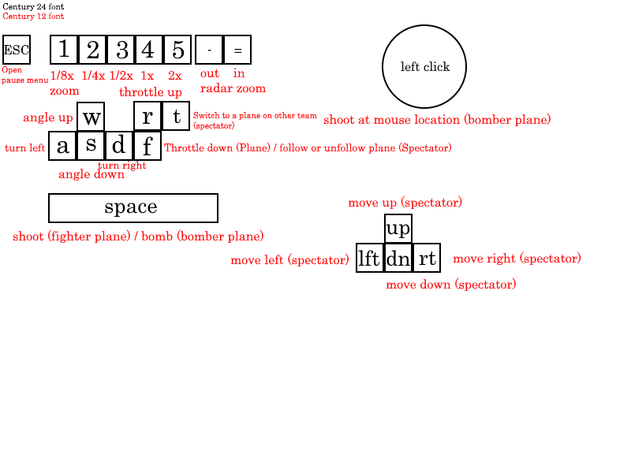
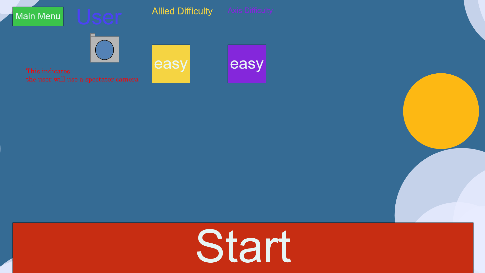
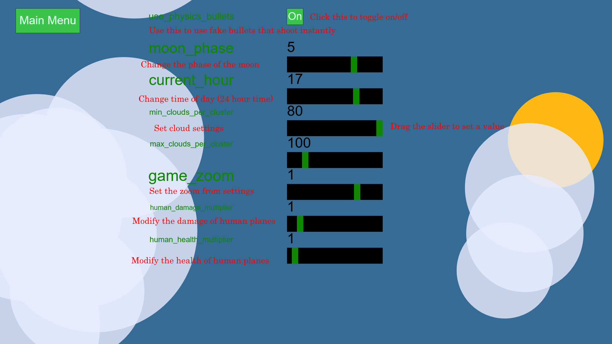

## Play the game
https://notsamj.github.io/WW2PlaneGame/

## (Outdated) Demo
[https://youtu.be/RkUOuSav_qA](https://www.youtube.com/watch?v=RkUOuSav_qA)

## Photo Guides
At bottom of README \
[Go to Photo Guides](#photo-guides)

## Dogfight
Select your chosen plane (or Camera) by clicking on the image under the heading "User"

(Optional) Select an allied bot plane by clicking on the image under the heading "Allies"

    - Add as many of these as you want by clicking on the "+1" or "+5" yellow buttons. They will be bots fighting in the dogfight.

(Optional). Select an axis plane by clicking on the image under the heading "Axis"

    - Add as many of these as you want by clicking on the "+1" or "+5" purple buttons. They will be bots fighting in the dogfight.

Review the bots that will be participating in the dogfight under the "Bot Details" header and remove as you see fit. You are recommended to use 40 or fewer planes for a dogfight, however, it varies with PC performance.

Select Ally and Axis bot difficulties by clicking on the buttons that specific difficulty (e.g. "easy")

Click on the start button to start the dogfight
#### See below instructions depending on the role you have selected
### How to play as an Allied plane in a Dogfight
If you start off as a plane facing right, then know you are an allied plane. Your task is to destroy all axis planes. These are the red dots on the radar in the top right.
#### See plane controls below.
### How to play as an Axis plane in a Dogfight
If you start off as a plane facing left, then know you are an axis plane. Your task is to destroy all allied planes. These are the red dots on the radar in the top right.
#### See plane controls below.
### How to play as an Attacker fighter plane in a Mission
If you start off as a fighter plane facing right, then know you are an attacker plane. Your task is to destroy Defender planes and protect your bomber(s). These are the red dots on the radar in the top right.
#### See plane controls below.
### How to play as an Attacker bomber plane in a Mission
If you start off as a bomber plane facing right, then know you are an attacker bomber plane. Your task is to destroy Defender planes and bomb the buildings. The buildings are the grey dots at the bottom of the radar.
#### See plane controls below.
### How to play as an Defender fighter plane in a Mission
If you start off as a fighter plane facing left, then know you are an defender plane. Your task is to destroy all attacker planes. Especially bombers. These are the red dots on the radar in the top right.
#### See plane controls below
## Campaign
Browse missions by clicking the previous/next buttons \
Select a mission by clicking "Select Mission" \
Select your chosen plane (or Camera) by clicking on the image under the heading "User" \
Select Ally and Axis bot difficulties by clicking on the buttons that specific difficulty (e.g. "easy") \
Click on the start button to start the mission
#### See below instructions depending on the role you have selected
### How to play as an attacker fighter plane in a Mission
If you start off facing right in a small plane in a Mission, your job is to defend your bomber plane while it bombs. If you die you will respawn after some time
### How to play as an attacker bomber plane in a Mission
If you start off facing right in a big plane in a Mission, your job is bomb the buildings (grey dots on mini map)
### How to play as a defender fighter plane in a Mission
If you start off facing left in a Mission, your job is to destroy the enemy bomber plane. If you die, you will respawn after some time
### How to play as a spectator
If you start off after selecting the camera, then know you are a spectator. Your task is to spectate however you wish. The yellow dots on the radar are allied planes, the purple are axis planes. \
See spectator camera controls below.
### How to play as a fighter plane
Fighter planes can shoot in the direction that their nose is pointed. For controls, see Plane and Fighter Plane below.
### How to play as a bomber plane
Bomber planes can drop bombs (useless in Dogfight, for buildings in Mission) and shoot with their turrets. The turrets will point at the cursor location and will shoot when instructed. For controls, see Plane and Bomber Plane below.
### Radar
The radar is logarithmic. At the time of writing 1 dot from center indicates a distance of 325 pixels, 2 dots 422 pixels, 3 dots 549 pixels, ... 18 dots 28113 pixels. \
Grey dots always indicate buildings
darker colours always indicate bombers
### Spectator Radar
As a spectator, yellow dots are allies, purple are axis
### Plane Radar
As a plane, red dots are enemies, green dots are friendlies
### Heat Bar
If you see a little bar in the bottom left of your screen, it is the gun heat bar. \
This bar represents the heat of the gun, it goes up as you shoot. \
When it becomes full, your gun gets a cooldown before it may shoot again. \
If you are using a Bomber you may see multiple of these, as the bomber has multiple guns.
## Multiplayer
Current a work in progress. Not available for testing in the online version, may be used by downloading from Github once it is finished.
## Sound
Sound sliders for the various sounds in the game
## Settings
A few extra settings
## Controls
Escape (Press): Open pause menu \
-: Zoom out the radar \
=: Zoom in the radar \
1 (Hold [over 150ms]): Switch to 1/8x game zoom temporarily \
1 (Press [under 150ms]): Switch to 1/8x game zoom \
2 (Hold [over 150ms]): Switch to 1/4x game zoom temporarily \
2 (Press [under 150ms]): Switch to 1/4x game zoom \
3 (Hold [over 150ms]): Switch to 1/2x game zoom temporarily \
3 (Press [under 150ms]): Switch to 1/2x game zoom \
4 (Hold [over 150ms]): Switch to 1x game zoom temporarily \
4 (Press [under 150ms]): Switch to 1x game zoom \
5 (Hold [over 150ms]): Switch to 2x game zoom temporarily \
5 (Press [under 150ms]): Switch to 2x game zoom

### Spectator Camera (General)
f (Press): Toggle between freely moving and focusing on a plane

### Spectator Camera (While focused)
Left Arrow (Press): Switch which plane is focused (directional) \
Right Arrow (Press): Switch which plane is focused (directional) \
t (Press): Immediately switch to spectating a plane on the other team

### Spectator Camera (While freely moving)
Up Arrow (Hold): Move up \
Down Arrow (Hold): Move down \
Left Arrow (Hold): Move left \
Right Arrow (Hold): Move right

### Plane
r (Hold): Increase throttle \
f (Hold): Decrease throttle \
w (Hold): Rotate clockwise \
s (Hold): Rotate counter clockwise \
a (Press): Sharp turn left \
d (Press): Sharp turn right

### Fighter Plane
Space (Hold): Shoot

### Bomber Plane
Space (Hold): Drop bombs \
Left click (Hold): Shoot

#photo-guides

## Main Menu (downloaded version [ww2planegame.html])

## Main Menu (web version [index.html])
Multiplayer is grayed out here because Multiplayer is disabled in the web version

## Keyboard Bindings

## Dogfight Menu
From this menu you may start a dogfight \
A user may click the camera to cycle through the plane selection \
A user may click either of the planes under the allies or axis header to cycle which bot they wish to add \
A user may click the yellow or purple "easy" button to cycle through bot difficulties

## Campaign Menu
From this menu you may select a mission to play

## Mission Start
From this menu you may start a mission \
A user may click the camera to cycle through the plane selection \
A user may click the yellow or purple "easy" button to cycle through bot difficulties

## Sound Menu
A user may drag the yellow rectangles to set their sound preference \
Main volume may be seen as a multiplier on all other volumes

## Extra Settings Menu

## Gameplay

### Dogfight Alone
This image shows what the game looks like if one decides to select a fighter plane and spawn in

### Test Mode
This image shows what the game looks like if one decides to spawn in without selecting anything \
Test mode is active when the requirement of 1+ plane on each team is not met \
Test mode means that the game will not be ended by planes dying

### Game Zoom
1/8x zoom

1/4x zoom

1/2x zoom

1x zoom

2x zoom \
The images used in this game have been scaled down from the originals, they are scale down to the size that \
they appear in 2x zoom. This means rather than seeing a scaled up version of a lower quality image in 2x you \
are seeing a higher quality image than in 1x

### Radar & Gun Heat UI
Fighter Radar

Bomber Radar

Spectator Radar

Radar Zoomed In

Radar Zoomed Out

### Dogfight
Playing as a fighter in a big dogfight

Playing as a bomber in a big dogfight

Playing as a spectator in a big dogfight

Dogfight End Screen \
This screen informs the user which team won the Dogfight and the kills obtained by various uses & classes of bot

### Campaign
In a Campaign misson, attacking planes have the task of protecting their bomber

In a Campaign misson, bombers are tasked with blowing up buildings. These are defended by defender fighter planes

Some visual effects appear when buildings blow up

When all buildings are destroyed OR all bombers are dead, the mission ends

